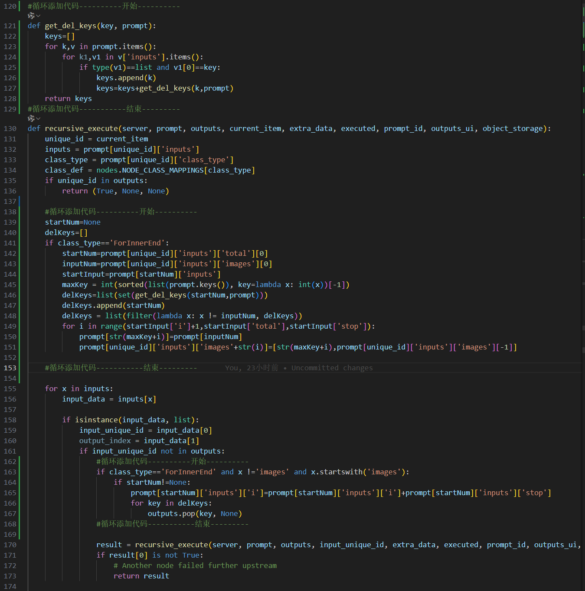

# ComfyUI_Lam

### 介绍
基于comfyUI开发的插件

#### 使用说明
下载放到comfyUI的插件目录，如下:


##### 特别说明该版本执行最新版“ComfyUI_windows_portable_nvidia_cu121_or_cpu.7z” 里面带cu121的版本地址如下：
https://github.com/comfyanonymous/ComfyUI/releases/download/latest/ComfyUI_windows_portable_nvidia_cu121_or_cpu.7z

然后运行install.bat文件，未报错后就可以了，

1. 模型地址，及存放路径：
lama模型：
https://huggingface.co/lllyasviel/Annotators/resolve/main/ControlNetLama.pth  ..\ComfyUI\models\lama\ControlNetLama.pth
SadTalker模型：
https://github.com/OpenTalker/SadTalker/releases/download/v0.0.2-rc/mapping_00109-model.pth.tar ..\ComfyUI\models\SadTalker\mapping_00109-model.pth.tar
https://github.com/OpenTalker/SadTalker/releases/download/v0.0.2-rc/mapping_00229-model.pth.tar ..\ComfyUI\models\SadTalker\mapping_00229-model.pth.tar
https://github.com/OpenTalker/SadTalker/releases/download/v0.0.2-rc/SadTalker_V0.0.2_256.safetensors ..\ComfyUI\models\SadTalker\SadTalker_V0.0.2_256.safetensors
https://github.com/OpenTalker/SadTalker/releases/download/v0.0.2-rc/SadTalker_V0.0.2_512.safetensors ..\ComfyUI\models\SadTalker\SadTalker_V0.0.2_512.safetensors


2. image-face-fusion模型换脸模型
链接：https://pan.baidu.com/s/19DOgJQ_RHNAjfNrzSr2uTQ?pwd=gf0p 
提取码：gf0p
解压到 ..\ComfyUI\models\image-face-fusion 目录


3. 修改comfyUI根目录下的execution.py文件，修改内容为,搜索“Return type mismatch between linked nodes”找到对应行，

搜索 “def recursive_execute” 
位置参考图如下：

新增内容：
```python
#循环添加代码----------开始----------
def get_del_keys(key, prompt):
    keys=[]
    for k,v in prompt.items():
        if v['class_type']=='ForInnerEnd' or v['class_type']=='ForInnerStart':
            continue
        for k1,v1 in v['inputs'].items():
            if type(v1)==list and v1[0]==key:
                keys.append(k)
                keys=keys+get_del_keys(k,prompt)
    return keys
#循环添加代码-----------结束---------
```
```python
    #循环添加代码----------开始----------
    startNum=None
    delKeys=[]
    backhaul={}
    clTypes=['ForInnerEnd','IfInnerExecute']
    oldPrompt=None
    if class_type in clTypes:
        oldPrompt=copy.deepcopy(prompt)

    if class_type=='ForInnerStart':
        print(class_type,'--------',prompt[unique_id]['inputs'])
    if class_type=='ForInnerEnd':
        startNum=prompt[unique_id]['inputs']['total'][0]
        inputNum=prompt[unique_id]['inputs']['obj'][0]
        startInput=prompt[startNum]['inputs']
        maxKeyStr=sorted(list(prompt.keys()), key=lambda x: int(x.split(':')[0]))[-1]
        maxKey = int(maxKeyStr.split(':')[0])
        delKeys=list(set(get_del_keys(startNum,prompt)))
        delKeys.append(startNum)
        delKeys = list(filter(lambda x: x != inputNum, delKeys))
        for key in delKeys:
            outputs.pop(key, None)
        for i in range(startInput['i']+1,startInput['total'],startInput['stop']):
            prompt[str(maxKey+i)]=prompt[inputNum]
            prompt[unique_id]['inputs']['obj'+str(i)]=[str(maxKey+i),prompt[unique_id]['inputs']['obj'][-1]]
            if i==startInput['i']+1:
                backhaul['obj'+str(i)]=prompt[unique_id]['inputs']['obj']
            else:
                backhaul['obj'+str(i)]=[str(maxKey+i-startInput['stop']),prompt[unique_id]['inputs']['obj'][-1]]

    #循环添加代码-----------结束---------
```
```python
                #循环添加代码----------开始----------
                if class_type=='ForInnerEnd' and x !='obj' and x.startswith('obj'):
                    if startNum!=None:
                        prompt[startNum]['inputs']['i']=prompt[startNum]['inputs']['i']+prompt[startNum]['inputs']['stop']
                        prompt[startNum]['inputs']['obj']=backhaul[x]
                        for key in delKeys:
                            outputs.pop(key, None)
                #循环添加代码-----------结束---------
```
```python
            #判断选择添加代码-----------结束---------
            if class_type=='IfInnerExecute' and x=='ANY':
                if outputs[input_unique_id][output_index][0]:
                    inputs['IF_FALSE']=oldPrompt[unique_id]['inputs']['IF_TRUE']
                else:
                    inputs['IF_TRUE']=oldPrompt[unique_id]['inputs']['IF_FALSE']
            #判断选择添加代码-----------结束---------
```
```python
        #循环添加代码----------开始----------
        if class_type=='ForInnerEnd':
            prompt[startNum]['inputs']=oldPrompt[startNum]['inputs']
            prompt[unique_id]['inputs']=oldPrompt[unique_id]['inputs']
        if class_type=='IfInnerExecute':
            prompt[unique_id]['inputs']=oldPrompt[unique_id]['inputs']
        #循环添加代码-----------结束---------
```
